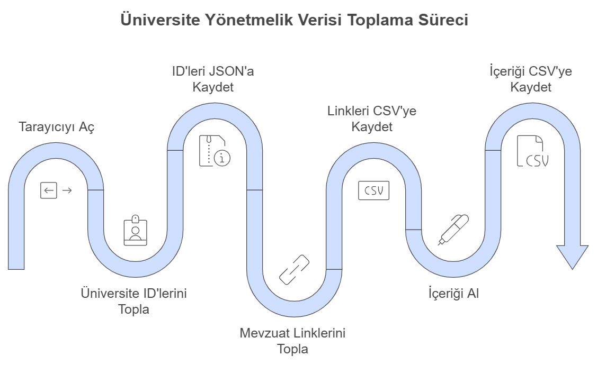

# Üniversite Yönetmelik Verisi Toplama

Bu proje, Türkiye’deki üniversitelerin mevzuat.gov.tr adresinde yer alan mevzuat linklerini ve içeriklerini otomatik olarak toplamak amacıyla geliştirilmiştir. 
Proje, Selenium ve BeautifulSoup gibi araçlar kullanılarak web sayfalarından veri çekme işlemlerini gerçekleştirir ve veriyi JSON ve CSV formatında saklar.

## Proje Yapısı

Proje üç ana adımdan oluşmaktadır:

**Üniversite ID'lerini ve İsimlerini Toplama**:
Üniversite ID'leri ve isimleri, mevzuat.gov.tr sayfasının ilgili bölümünden alınarak university_id.json dosyasına kaydedilir.

**Mevzuat Linklerini Toplama**:
Her üniversite için 2000-2024 tarihleri arasındaki mevzuat belgeleri seçilir ve bu belgelerin linkleri toplanır.
Bu linkler, üniversite isimleriyle birlikte mevzuat_links.csv dosyasına kaydedilir.

**Mevzuat İçeriklerini Çekme**:
Proje, her bir mevzuat linkini açarak belge içeriğini ve Resmi Gazete bilgilerini çıkarır ve bu veriler mevzuat_content.csv dosyasına kaydedilir.

## Proje Şeması

